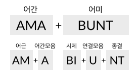

개요
====

동사의 구조
-----------

라틴어 동사의 일반적인 구조는 다음과 같다. 예시문은 amābunt((그들은) 사랑할 것이다.)로, amō의 미래형이다.

라틴어 동사는 어간모음에 따라서 변화양상이 바뀌며, 어간모음 ‘ā, ē, ∅, ĭ, ī’에 따라서 5가지로 분류한다. 어간모음이 없는 경우(∅), 즉 어간이 자음으로 끝나는 경우와 단음 i(ĭ)는 같은 제3변화로 분류한다.

위의 예에서는 ‘ā’가 어간모음이며, 제1변화 동사로 분류한다. 예로 든 미래 시제의 경우, 같은 시제라도 제1, 제2변화 동사의 변화 유형과 제3, 제4변화 동사의 변화 유형이 판이하게 다르다.

선어말어미에는 동사의 3가지 시제와 2가지 상(相)과 3가지 법(法)을 나타내는 어미가, 종결어미에는 3가지 인칭과 2가지 수(數)와 2가지 태(態)를 나타내는 어미가 붙는다. 현재 시제에는 선어말어미를 붙이지 않는다.

위의 예에서는 ‘-bi-’가 미래 시제의 의미를 가지고 있는 선어말어미이며, 종결어미와 결합하면서 ‘i’가 탈락되었다. 또, ‘-nt’는 능동태 3인칭 복수를 타나내는 종결어미이다.

어간과 어미, 또는 어미와 어미를 결합할 때 발음의 편의를 위해 ‘e, i, u’ 등의 모음을 삽입하기도 하는데, 이 책에서는 연결모음으로 부르도록 하겠다.

위의 예에서는 선어말어미 ‘-bi-’와 종결어미 ‘-nt’ 사이에 발음의 편의를 위해서 ‘u’가 삽입되었다. 3인칭 복수에 ‘u’가 삽입되는 것은 제3, 제4변화 동사의 현재형, 제1, 제2변화 동사의 미래형, 모든 동사의 현재 완료형 뿐이다.

.. note::

   여기서는 제1변화 동사 미래 3인칭 복수 어미에 삽입된 u를 편의상 연결모음으로 정의하였으나, 이것이 의미가 없이 발음의 편의를 위해 첨가된 연결모음인지 다른 변화의 과정에서 유래한 것인지는 명확하지 않다.

이외에도 발음의 편의를 위해 변화한 것으로 추정되는 것들이 있는데, 동사에서는 대표적으로 완료형의 선어말어미 ‘-is-’가 ‘-er-’로 바뀌거나, s가 탈락한 경우가 있는 것으로 추정한다. [Allen & Greenough, §169. Note들]

모든 동사가 이런 형태를 가지고 있는 것은 아니다. 변화 형태가 다른 불규칙 동사와, 변화 형태가 한정된 탈형 동사도 있다.

또, 비한정사로 쓰이는 부정사, 분사, 동명사, 동형용사, 목적분사 등이 있으며, 수동태의 완료형은 과거분사와 sum의 미완료형을 결합하여 만든다. ::

   amātus erās (너는) 사랑받아 왔었다. (수동태 과거완료형. erās는 sum의 과거미완형.)

.. 한국어에서도 동사의 수동형은 다른 동사와 결합해서 만들어지기도 한다. -> 수동태 항목에 적을 것.

.. note::

   연결모음은 한국어 문법에서 사용하는 용어이며, 매개(媒介)모음이라고도 한다. :ref:`[성염] <성염>`\은 어간모음을 연결모음으로 불렀다.

   그런데 독일어에서는 어간모음(Stammvokal)을 연결모음(Bindevokal)의 하위개념으로 사용하기도 하며, 홀로도비치의 『한국어 문법 개론』(1954) 등에서는 한국 학계에서 연결모음으로 분류하는 ‘-으-, -아/어-’ 등을 어간모음으로 보기도 하였다. [趙義成, `「현대 한국어 용언 어간의 조정(措定)에 대하여」 <http://www.tufs.ac.jp/ts/personal/choes/korean/base/goki.html#2.3>`_ 참고]

   또, 제3변화 동사에서는 연결모음이 어간모음의 자리에 삽입되므로, 연결모음과 어간모음의 구분은 모호한 면이 있다.

.. todo:: 연결모음 항목 분리시킬 것인지 생각해볼 것.

동사 변화표
-----------

동사의 변화표는 가로는 단수와 복수의 2열, 세로는 인칭별 3열로 이루어진 표로 만든다.

+-------+------+------+
|       | 단수 | 복수 |
+-------+------+------+
| 1인칭 |      |      |
+-------+------+------+
| 2인칭 |      |      |
+-------+------+------+
| 3인칭 |      |      |
+-------+------+------+

인칭은 숫자 1, 2, 3으로, 단수는 s(singularis), 복수는 p(pluralis)를 이용해 기호로 표기하기도 한다. 예를 들어 3인칭 단수는 3s로 표기한다.

.. note::
   그리스어나 로망스어에서는 인칭대명사와 함께 동사의 변화를 표기하는 것이 일반적인데, 라틴어에서는 인칭 대명사의 생략이 일반적이어서 인칭대명사 없이 표를 만든다.

   한국어 번역을 쓸 때는 인칭이 불분명할 수 있으므로, 괄호 안에 인칭대명사를 적기도 한다. ::

      amābunt (그들은) 사랑할 것이다.
