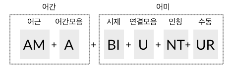

개요
====

라틴어 동사는 :ref:`어간 <동사의 어간>`\과 :ref:`어미 <동사의 어미>`\로 이루어져 있다.

어간은 미완료형, 완료형, 분사형 3가지가 있으며, 동사의 변화 형태에 따라서 사용되는 어간이 다르다.

또한, 어간모음에 따라 동사를 제1~제4변화로 분류하는데, 이에 따라 동사의 변화 양상이 다르다. 특히 과거, 미래, 접속법 현재, 현재 분사에서는 어간모음에 따라서 어미가 바뀌므로 동사의 분류를 알고 있어야 한다.

어미는 인칭과 시제 등에 따라서 변화한다. 인칭, 수(數), 태(態)는 종결어미에서 드러나고 시제, 상(相), 법(法)은 선어말어미에서 드러난다. 단 현재완료형은 종결어미가 다르다.

변화 형태가 다른 불규칙 동사와, 변화 형태가 한정된 탈형 동사와 같은 동사도 있다.

동사는 비한정적인 형태도 있다. 부정사는 변화하지 않으면서 명사로 쓰이고, 분사와 동형용사는 형용사로 쓰이며, 형용사와 마찬가지로 성, 수, 격 일치를 한다.

일부 변화 형태는 다른 변화 형태를 차용한다. 일부 부정사와 수동태 완료형은 분사를, 동명사는 동형용사의 형태를 빌어서 사용한다.

.. todo:: 전체 구조를 보여주는 표 넣을 것

동사의 변화 형태 예시
---------------------

한정적으로 사용되는 라틴어 동사의 일반적인 구조를 예시하면 다음과 같다.

예시문은 amābuntur((그들은) 사랑받을 것이다)로, amō의 수동태 미래형이다.

amō는 ‘ā’가 어간모음이며, 어간모음이 ‘ā’인 동사는 제1변화 동사로 분류한다. 동사는 같은 시제라도 어간모음에 따라 다르게 변화한다. 특히 미래 시제의 경우, 제1, 제2변화 동사의 변화 유형과 제3, 제4변화 동사의 변화 유형이 판이하게 다르다.

‘-bi-’는 미래 시제의 의미를 가지고 있는 선어말어미이며, 종결어미와 결합하면서 ‘i’가 탈락되었다. ‘-nt’는 능동태 3인칭 복수의 종결어미이다.

또, 선어말어미 ‘-bi-’와 종결어미 ‘-nt’ 사이에 발음의 편의를 위해서 ‘u’가 삽입되었다. 3인칭 복수에 ‘u’가 삽입되는 것은 제3, 제4변화 동사의 현재형, 제1, 제2변화 동사의 미래형, 모든 동사의 현재 완료형 뿐이다.

‘-ur’는 3인칭 복수에 붙는 수동태 접사이다. 그런데 수동태 종결어미의 변화 양상은 불규칙하므로 일반적으로 ‘-ntur’ 전체를 수동태 어미로 본다.

.. image:: amatus_eras.svg

예시문은 amātus erās((너는) 사랑받아 왔었다)로, amō의 수동태 과거완료형이다.

수동태 완료형은 따로 어미가 있는 것이 아니라, sum동사의 과거형에 과거분사를 보어처럼 붙여서 사용한다.

일반적인 어미에서는 성이 드러나지 않지만, 과거분사는 형용사이므로 주어에 따라 성, 수 일치시킨다. 여기서는 amātus가 남성 단수형이므로 주어가 남성 단수임을 알 수 있다. 격은 주어와 일치시키는 것이므로 수동태 완료형으로 쓰이는 과거분사는 모두 주격이다.

.. note::

   여기서는 제1변화 동사 미래 3인칭 복수 어미에 삽입된 u를 편의상 연결모음으로 정의하였으나, 이것이 의미가 없이 발음의 편의를 위해 첨가된 연결모음인지 다른 변화의 과정에서 유래한 것인지는 명확하지 않다.

   동사에서는 보통 i가 있는 경우에 u가 나타나므로, i와 관련이 있는 것으로 볼 수도 있다.

.. note::

   이러한 설명들이 단어의 실제 생성 과정을 반영하는 것은 아니다.

연결모음
--------

어간과 어미, 또는 어미와 어미를 결합할 때 발음의 편의를 위해 ‘e, i, u’ 등의 모음을 삽입하기도 하는데, 이 책에서는 연결모음으로 부르도록 하겠다.

이외에도 발음의 편의를 위해 변화한 것으로 추정되는 것들이 있는데, 동사에서는 대표적으로 완료형의 선어말어미 ‘-is-’가 ‘-er-’로 바뀌거나, s가 탈락한 경우가 있는 것으로 추정한다. [Allen & Greenough, §169. Note들]

.. note::

   연결모음은 한국어 문법에서 사용하는 용어이며, 매개(媒介)모음이라고도 한다. :ref:`[성염] <성염>`\은 어간모음을 연결모음으로 불렀다.

   그런데 독일어에서는 어간모음(Stammvokal)을 연결모음(Bindevokal)의 하위개념으로 사용하기도 하며, 홀로도비치의 『한국어 문법 개론』(1954) 등에서는 한국 학계에서 연결모음으로 분류하는 ‘-으-, -아/어-’ 등을 어간모음으로 보기도 하였다. [趙義成, `「현대 한국어 용언 어간의 조정(措定)에 대하여」 <http://www.tufs.ac.jp/ts/personal/choes/korean/base/goki.html#2.3>`_ 참고]

   또, 제3변화 동사에서는 연결모음이 어간모음의 자리에 삽입되므로, 연결모음과 어간모음의 구분은 모호한 면이 있다.

동사 변화표
-----------

동사의 변화표는 가로는 단수와 복수의 2열, 세로는 인칭별 3열로 이루어진 표로 만든다.

+-------+------+------+
|       | 단수 | 복수 |
+-------+------+------+
| 1인칭 |      |      |
+-------+------+------+
| 2인칭 |      |      |
+-------+------+------+
| 3인칭 |      |      |
+-------+------+------+

인칭은 숫자 1, 2, 3으로, 단수는 s(singularis), 복수는 p(pluralis)를 이용해 기호로 표기하기도 한다. 예를 들어 3인칭 단수는 3s로 표기한다.

한국어는 단수와 복수 구분을 하지 않지만, 일반적으로 이러한 인도유럽어 동사를 표현하기 위해서 나(단수)/우리(복수), 너(단수)/너희(복수), 그(단수)/그들(복수)로 구분해서 표기한다.

그러나 번역을 할 때는 자연스러운 한국어를 선택해야 할 것이며, 단순한 수의 구분이 아니라 존칭이나 겸양, 권유의 뜻인 경우도 있으므로 일률적으로 번역할 수는 없다.

.. note::

   그리스어나 로망스어에서는 인칭대명사와 함께 동사의 변화를 표기하는 것이 일반적인데, 라틴어에서는 인칭 대명사의 생략이 일반적이어서 인칭대명사 없이 표를 만든다.

   한국어 번역을 쓸 때는 인칭이 불분명할 수 있으므로, 괄호 안에 인칭대명사를 적기도 한다.

      | amābunt (그들은) 사랑할 것이다.

학습 순서
---------

* 부정사는 동사의 비한정적 용법이지만, 사전을 찾는데 현재 부정사가 필요하므로 가장 처음에 배울 필요가 있다.

* 수동태 완료형은 직설법이지만 비한정적 용법인 과거분사를 사용하므로 배우는 순서가 분사의 뒤로 가게 된다.

* 동사의 변화가 분량이 많기 때문에 일반적인 교재에서는 보통 다른 파트와 함께 병행해서 진도를 나간다.

.. todo:: 일부 교재의 학습 순서 인용할 것.
