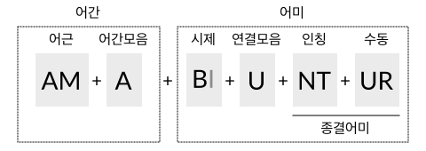

동사의 변화(1) 개요
===================

라틴어 동사는 :ref:`어간 <동사의 어간>`\과 :ref:`어미 <동사의 어미>`\로 이루어져 있다.

어간은 미완료형, 완료형, 분사형 3가지가 있으며, 동사의 변화 형태에 따라서 사용되는 어간이 다르다.

또한, 어간모음에 따라 동사를 제1~제4변화로 분류하는데, 이에 따라 동사의 변화 양상이 다르다. 특히 과거, 미래, 접속법 현재, 현재 분사에서는 어간모음에 따라서 어미가 바뀌므로 동사의 분류를 알고 있어야 한다.

어미는 인칭과 시제 등에 따라서 변화한다. 인칭, 수(數), 태(態)는 종결어미에서 드러나고 시제, 상(相), 법(法)은 선어말어미에서 드러난다. 단 현재완료형은 종결어미가 다르다.

변화 형태가 다른 불규칙 동사와, 변화 형태가 한정된 탈형 동사와 같은 동사도 있다.

동사는 비한정적인 형태도 있다. 부정사는 변화하지 않으면서 명사로 쓰이고, 분사와 동형용사는 형용사로 쓰이며, 형용사와 마찬가지로 성, 수, 격 일치를 한다.

일부 변화 형태는 다른 변화 형태를 차용한다. 일부 부정사와 수동태 완료형은 분사를, 동명사는 동형용사의 형태를 빌어서 사용한다.

.. todo:: 전체 구조를 보여주는 표 넣을 것

동사의 변화 형태 예시
---------------------

한정적으로 사용되는 라틴어 동사의 일반적인 구조를 예시하면 다음과 같다.

예시문은 amābuntur((그들은) 사랑받을 것이다)로, amō의 수동태 미래형이다.

amō는 ‘ā’가 어간모음이며, 어간모음이 ‘ā’인 동사는 제1변화 동사로 분류한다. 동사는 같은 시제라도 어간모음에 따라 다르게 변화한다. 특히 미래 시제의 경우, 제1, 제2변화 동사의 변화 유형과 제3, 제4변화 동사의 변화 유형이 판이하게 다르다.

‘-bi-’는 미래 시제의 의미를 가지고 있는 선어말어미이며, 종결어미와 결합하면서 ‘i’가 탈락되었다. ‘-nt’는 능동태 3인칭 복수의 종결어미이다.

또, 선어말어미 ‘-bi-’와 종결어미 ‘-nt’ 사이에 발음의 편의를 위해서 ‘u’가 삽입되었다. 3인칭 복수에 ‘u’가 삽입되는 것은 제3, 제4변화 동사의 현재형, 제1, 제2변화 동사의 미래형, 모든 동사의 현재 완료형 뿐이다.

‘-ur’는 3인칭 복수에 붙는 수동태 접사이다. 그런데 수동태 종결어미의 변화 양상은 불규칙하므로 일반적으로 ‘-ntur’ 전체를 수동태 어미로 본다.

예시문은 amātus erās((너는) 사랑받아 왔었다)로, amō의 수동태 과거완료형이다.

수동태 완료형은 따로 어미가 있는 것이 아니라, sum동사의 과거형에 과거분사를 보어처럼 붙여서 사용한다.

일반적인 어미에서는 성이 드러나지 않지만, 과거분사는 형용사이므로 주어에 따라 성, 수 일치시킨다. 여기서는 amātus가 남성 단수형이므로 주어가 남성 단수임을 알 수 있다. 격은 주어와 일치시키는 것이므로 수동태 완료형으로 쓰이는 과거분사는 모두 주격이다.

.. note::

   여기서는 제1변화 동사 미래 3인칭 복수 어미에 삽입된 u를 편의상 연결모음으로 정의하였으나, 이것이 의미가 없이 발음의 편의를 위해 첨가된 연결모음인지 다른 변화의 과정에서 유래한 것인지는 명확하지 않다.

   동사에서는 보통 i가 있는 경우에 u가 나타나므로, i와 관련이 있는 것으로 볼 수도 있다.

.. note::

   이러한 설명들이 단어의 실제 생성 과정을 반영하는 것은 아니다.

연결모음
--------

어간과 어미, 또는 어미와 어미를 결합할 때 발음의 편의를 위해 ‘e, i, u’ 등의 모음을 삽입하기도 하는데, 이 책에서는 연결모음으로 부르도록 하겠다.

이외에도 발음의 편의를 위해 변화한 것으로 추정되는 것들이 있는데, 동사에서는 대표적으로 완료형의 선어말어미 ‘-is-’가 ‘-er-’로 바뀌거나, s가 탈락한 경우가 있는 것으로 추정한다. [Allen & Greenough, §169. Note들]

.. note::

   연결모음은 한국어 문법에서 사용하는 용어이며, 매개(媒介)모음이라고도 한다. :ref:`[성염] <성염>`\은 어간모음을 연결모음으로 불렀다.

   그런데 독일어에서는 어간모음(Stammvokal)을 연결모음(Bindevokal)의 하위개념으로 사용하기도 하며, 홀로도비치의 『한국어 문법 개론』(1954) 등에서는 한국 학계에서 연결모음으로 분류하는 ‘-으-, -아/어-’ 등을 어간모음으로 보기도 하였다. [趙義成, `「현대 한국어 용언 어간의 조정(措定)에 대하여」 <http://www.tufs.ac.jp/ts/personal/choes/korean/base/goki.html#2.3>`_ 참고]

   또, 제3변화 동사에서는 연결모음이 어간모음의 자리에 삽입되므로, 연결모음과 어간모음의 구분은 모호한 면이 있다.

동사 변화표
-----------

동사의 변화표는 가로는 단수와 복수의 2열, 세로는 인칭별 3열로 이루어진 표로 만든다.

+-------+------+------+
|       | 단수 | 복수 |
+-------+------+------+
| 1인칭 |      |      |
+-------+------+------+
| 2인칭 |      |      |
+-------+------+------+
| 3인칭 |      |      |
+-------+------+------+

인칭은 숫자 1, 2, 3으로, 단수는 s(singularis), 복수는 p(pluralis)를 이용해 기호로 표기하기도 한다. 예를 들어 3인칭 단수는 3s로 표기한다.

한국어는 단수와 복수 구분을 하지 않지만, 일반적으로 이러한 인도유럽어 동사를 표현하기 위해서 나(단수)/우리(복수), 너(단수)/너희(복수), 그(단수)/그들(복수)로 구분해서 표기한다.

그러나 번역을 할 때는 자연스러운 한국어를 선택해야 할 것이며, 단순한 수의 구분이 아니라 존칭이나 겸양, 권유의 뜻인 경우도 있으므로 일률적으로 번역할 수는 없다.

.. note::

   그리스어나 로망스어에서는 인칭대명사와 함께 동사의 변화를 표기하는 것이 일반적인데, 라틴어에서는 인칭 대명사의 생략이 일반적이어서 인칭대명사 없이 표를 만든다.

   한국어 번역을 쓸 때는 인칭이 불분명할 수 있으므로, 괄호 안에 인칭대명사를 적기도 한다.

      | amābunt (그들은) 사랑할 것이다.

학습 순서
---------

* 부정사는 동사의 비한정적 용법이지만, 사전을 찾는데 현재 부정사가 필요하므로 가장 처음에 배울 필요가 있다.

* 수동태 완료형은 직설법이지만 비한정적 용법인 과거분사를 사용하므로 배우는 순서가 분사의 뒤로 가게 된다.

* 동사의 변화가 분량이 많기 때문에 일반적인 교재에서는 보통 다른 파트와 함께 병행해서 진도를 나간다.

.. todo:: 일부 교재의 학습 순서 인용할 것.

.. _동사의 어간:

동사의 어간
-----------

라틴어의 동사 변화(활용)에서 변화하지 않는 부분을 어간이라고 한다.

한국어에서와 달리 라틴어를 포함하는 인도유럽어에서는 어간도 어간모음에 따라 변화하는 것으로 보며, 한 단어의 어간도 2개 이상인 경우가 많다.

라틴어에서는 동사의 어간을 미완료형(현재형), 완료형(과거형), 분사형(목적분사) 3가지로 보며, 이를 표시하기 위해 사전 표제어를 4개 사용한다.

   | amō, amāre, amāvī, amātum (사랑하다. 제1변화 동사)

사전 표제어가 하나 더 많은 것은 어간모음에 따른 동사의 분류를 나타내는 단어를 하나 더 추가하기 때문이다.

.. note::
   어근(語根)이라고 부르는 경우도 있으나, 어근은 변화하는 단어의 공통분모 형태를 의미한다기보다 역사적이고 더 근원적인 형태를 말한다고 볼 수 있으므로 여기서는 어근과 어간을 구분해서 사용하기로 한다.

.. note::
   참고로 라틴어 명사의 어간은 2개인 경우가 많다. 그래서 명사의 사전 표제어는 2개로 이루어진다. 어간모음에 따른 명사의 분류는 하나의 단어에 어간과 함께 표기해서 단어가 추가되지 않는다.

어간모음
--------

명사의 변화 항목 참조.

어간모음에 따른 동사의 분류
---------------------------

라틴어에서 동사의 어간 변화 양상은 어간모음 ā, ē, i, ī 4가지와 어간 끝이 자음이어서 어간모음이 없는 경우(∅) 5가지로 나누며, 어간 끝이 자음인 경우와 어간모음이 단음 i인 경우는 변화 양상이 비슷해서 같은 제3변화로 분류한다.

어간모음이 o, u인 경우는 극소수이며, 불규칙 변화로 분류한다.

어간모음은 동사의 능동태 현재 부정사 형태에서 가장 잘 드러난다.

.. csv-table::
   :header-rows: 1
   :widths: auto

   "어간모음", "분류", "현재 부정사"
   "ā", "제1변화", "am\ :em:`ā`\ re(사랑하는 것)"
   "ē", "제2변화", "ten\ :em:`ē`\ re(잡는 것)"
   "∅(없음. 자음으로 끝남)", "제3변화(제3변화 1식, 제3변화 o형)", "dūc\ :em:`e`\ re(이끄는 것) [*]_"
   "i(단음)", "제3변화(제3변화 2식, 제3변화 io형)", "cap\ :em:`e`\ re(잡는 것) [*]_"
   "ī(장음)", "제4변화", "aud\ :em:`ī`\ re(듣는 것)"

.. todo:: 의미가 중복되지 않는 적절한 예시 단어 찾아볼 것

.. [*] 연결모음이 필요한 경우 중성모음 e또는 i가 삽입된다. i는 동사의 현재형, 명령법에, e는 동사의 접속법 과거형과 부정사 등에서 사용한다.

.. todo:: 중성모음 개념이 적절한지 확인할 것

.. [*] 어간모음으로 사용되는 단음 i는 변화에 따라서 드러나기도 하고 드러나지 않기도 하며, 동사의 현재형과 같은 경우에는 e가 삽입되기도 한다.

.. note::
   동사의 변화를 이렇게 어간모음에 따라 분류하는 건 그리스어 문법의 영향을 받은 로마의 문법서에서 시작되었다. 바로와 도나투스는 3가지로 분류하였고, 사케르도스, 도시티아누스, 프리스키아누스는 4가지로 분류하였다.

.. note::
   명사 변화와 비교해보면, 제1변화는 a어간, 제3변화는 자음어간과 단음 i어간 화인 점이 명사 변화와 동일하나, 명사 제2변화는 o어간 변화이고, 명사의 e어간 변화는 제5변화인 점이 다르다. 또한, 장음 i어간 변화가 명사에서는 제3변화에 속해있으나, 동사에서는 제4변화로 독립되어 있는 점도 다르다.

어간의 종류
----------------

동사의 어간 종류는 3가지로 나눈다.

.. csv-table::
   :widths: auto

   "기본형", "amō(사랑하다)", "timeō(무서워하다)"
   "미완료형(현재형) 어간", "amā-", "timē-"
   "완료형(과거형) 어간", "amāv-", "timu-"
   "분사형(목적분사형) 어간", "amāt-", "X"

.. todo:: 불규칙 동사, deponent verb를 포함하는 더 적절한 예시 찾아볼 것

이 3가지 어간을 모두 갖고 있지 않은 동사도 있는데, 해당 어간을 사용하는 동사의 변화가 없는 경우이다.

미완료형 어간에 -v와 -t 같은 접사를 추가하는 등의 방법으로 완료형과 분사형을 규칙적으로 생성하는 경우도 많으나, 불규칙한 경우도 많기 때문에 어간을 3개로 규정하고, 사전에서 어간의 형태를 확인해야 하는 것이 보통이다.

완료형, 분사형 어간 변화 유형
-----------------------------

완료형에는 -v, 분사형에는 -t를 붙인 경우

.. csv-table::
   :header-rows: 1
   :widths: auto

   "기본형", "미완료형", "완료형", "분사형"
   "amō(I)", "amā-", "amāv-", "amāt-"
   "flēo(II)", "flē-", "flēv-", "flēt-"
   "cupiō(III-io)", "cup-", "cupīv-", "cupīt-"
   "audiō(IV)", "audī-", "audīv-", "audīt-"

완료형에는 -u, 분사형에는 -it을 붙인 경우

.. csv-table::
   :header-rows: 1
   :widths: auto

   "기본형", "미완료형", "완료형", "분사형"
   "sonō(I)", "sonā-", "sonu-", "sonit-"
   "habeō(II)", "habē-", "habu-", "habit-"

변화별 어간
-----------

각 어간이 사용되는 변화는 아래와 같다. 어간은 3종류로 고정되어 있고 어미는 능동태와 수동태 2 종류를 사용한다. [*]_

.. [*] 능동태 현재 완료형 어미까지 합하면 3종류.

.. csv-table::
   :header-rows: 1
   :widths: auto

   어간, 법, 부정법, 기타
   미완료형, 직설법과 명령법과 접속법, 현재 부정사와 현재 분사, 동형용사와 동명사
   완료형, 직설법 완료와 접속법 완료, 과거 부정사,
   분사형, , 과거 분사와 미래 분사, 목적분사

미완료형이 동사의 기본적인 변화에 사용되며, 완료형 어간은 완료형을, 분사형은 분사를 만들기 위해 변화한 것임을 추측할 수 있다.

부정사와 동명사, 목적분사는 명사처럼 다뤄지고, 분사와 동형용사는 형용사처럼 다뤄진다.

.. _동사의 어미:

동사의 어미
-----------

어미는 시제, 상(相), 법(法), 인칭, 수(數), 태(態)에 따라 변화하며, 현재완료형 일부를 제외하면 인칭, 수, 태는 종결어미에서 드러나고, 나머지는 선어말어미에서 드러난다.

능동태 어미와 수동태 어미
-------------------------

동사의 끝에 오는 어미는 능동태 어미와 수동태 어미 두 가지이다.

.. image:: end0.svg

수동태 2인칭 단수 어미는 ``-re``\도 사용한다.

라틴어 동사의 변화는 다양하지만 어미는 이 두가지를 사용한다.

   | amā(사랑하다의 미완료형 어간) + s(능동태 2인칭 단수 어미) = amās (너는) 사랑한다.
   | amā + ris 또는 re(수동태 2인칭 단수 어미) = amāris 또는 amāre (너는) 사랑받는다.

예외적으로 현재 완료형에서 능동태 어미가 ``-ī``\로 불규칙 변화한다.

.. todo:: 현재 완료 어미 변화 표로 만들 것.

능동태 어미 O를 사용하는 시제에서는 수동태 어미 OR을 사용하고, 능동태 어미 M을 사용하는 시제에서는 수동태 어미 R을 사용한다.

   * ``-ō``\와 ``-or``\를 사용하는 시제: 현재, 미래(I, II), 미래 완료
   * ``-m``\과 ``-r``\를 사용하는 시제: 과거, 미래(III, IV), 과거 완료 그리고 모든 접속법.
   * ``-ī``\를 사용하는 시제: 현재 완료 뿐

단, 수동태 직설법 완료형과 수동태 접속법 완료형은 수동태 어미를 사용하지 않고 각각 sum 동사의 능동태 직설법 미완료형과 능동태 접속법 미완료형을 합성해서 만든다.

또한, ``-ō``\와 ``-or``\을 사용하는 경우는 어간과 어미가 다른 인칭과 다르게 변화한다.

이 두가지 어미를 사용하지 않는 경우는 다음과 같다.

   - 현재 완료형에서 불규칙하게 변화하는 능동태 어미
   - 동사의 어간을 그대로 사용하는 명령법
   - 명사로 사용하는 부정사와 동명사
   - 형용사로 사용하는 분사와 동형용사
   - 불규칙 동사

.. note::
   인칭에 따라 변화하므로 인칭 어미라고 부르는 교재도 있다. 한국어 문법용어로는 어말어미 또는 종결어미이다.

어미 앞의 변화
--------------

능동태 1인칭 단수, 3인칭 단수와 복수, 수동태 1인칭 단수와 3인칭 복수 어미 앞에서는 장모음이 단모음으로 바뀐다.

.. csv-table::
   :header-rows: 1
   :widths: auto

   "", "능동태", "", "수동태"
   "\*", "O | M", "\*", "OR | R"
   "", "S", "", "RIS(RE)"
   "\*", "T", "", "TUR"
   "", "MUS", "", "MUR"
   "", "TIS", "", "MINI"
   "\*", "NT", "\*", "NTUR"

능동태에서는 -O, 수동태에서는 -OR을 사용하는 현재(I, III-O), 미래(I, II), 미래 완료의 1인칭 단수의 어미 앞 모음은 생략된다.

현재(III, IV), 미래(I, II), 현재 완료의 3인칭 복수 어미 앞에는 연결모음 U가 추가되어 능동태는 -UNT, 수동태는 -UNTUR가 된다.

미래(III, IV)의 1인칭 단수 어미 앞은 연결모음이 A가 되서, 능동태는 -AM, 수동태는 -AR가 된다.

미래(I, II)의 수동태 2인칭 단수 어미 앞의 연결모음은 -E가 되서, -BERIS 또는 BERE가 된다.

.. todo:: 예시 추가할 것.

사전 표제어
-----------

사전에는 동사의 현재형(현재 미완료형), 현재 부정사, 현재 완료형, 과거분사 완료형 4가지를 표제어로 사용한다.

+------+------------------------------------------+--------+-----------------+
| 순서 | 대표 시제                                | 예시   | 추출 어간       |
+------+------------------------------------------+--------+-----------------+
| 1    | 직설법 능동태 현재 미완료형의 1인칭 단수 | amō    | amā- (미완료형) |
+------+------------------------------------------+--------+                 |
| 2    | 능동태 현재형 부정사                     | amāre  |                 |
+------+------------------------------------------+--------+-----------------+
| 3    | 직설법 능동태 현재 완료형의 1인칭 단수   | amāvī  | amāv- (완료형)  |
+------+------------------------------------------+--------+-----------------+
| 4    | 수동태 과거 분사의 남성형 목적격 단수    | amātum | amāt- (분사형)  |
|      |                                          |        |                 |
|      | 또는 과거 분사 완료형(PPP)               |        |                 |
|      |                                          |        |                 |
|      | 또는 목적 분사의 대격                    |        |                 |
+------+------------------------------------------+--------+-----------------+

현재 부정사는 두번째에 오기도 하고, 마지막에 오기도 하며, 숫자로도 대체된다.

   | amō, -āre, -āvī, -ātum vt [CLDG2]_
   | amō, ~āre, ~āuī, ~ātum, :abbr:`tr. (transitive)`, :abbr:`intr. (intransitive)` [Oxford]_
   | ămo, āvī, ātum, āre, tr. [Gaffiot]_
   | ămo, āvi, ātum, 1, v. :abbr:`a. (active)` [Lewis & Short]
   | ămo, 1. [*]_ [Cassell]_

.. [*] 제1변화하는 규칙변화 동사임을 의미한다.

3종류의 어간을 모두 가지고 있지 않은 동사는 생략하거나 ‘—’로 표기하기도 한다.

    | timeō, -ēre, -uī vt, vi [CLDG2]_
    | timeō, uī, —, ēre [Lewis]_
    | tĭmĕo, ŭi, ēre, tr. [Gaffiot]_
    | tĭmĕo, ŭi, 2, v. a. [Lewis & Short]
    | tĭmĕo, ŭi, 2. [Cassell]_

    | āiō, intr., tr. defec. [Oxford]_
    | āio, defective verb. [Cassell]_
    | āio, ăĭs, [*]_ verbe défectif [Gaffiot]_

.. [*] 미완료형 어간을 보여주기 위해서 2인칭 단수 형태를 적은 것.

이 4가지 대표 시제를 Stammform(기본형), principal parts(으뜸꼴들)이라고 부르기도 한다. ‘동사의 4주(四柱)’라는 이름을 붙인 경우도 있다. [김남우]

동사의 표제어가 4개나 되는 것은 동사의 3가지 어간에 기본형인 1인칭 단수 현재형이 더해졌기 때문이다.

현재형 1인칭 단수는 미완료형 어간을 사용하므로 미완료형 어간은 중복된다. 그러나 현재형 1인칭 단수는 어간모음이 생략되어 있는 경우가 많아서, 어간모음을 유추할 수 있는 정보가 필요하다.

사전에 따라서는 미완료형 어간을 사용한 기본형만을 표제어로 삼는 경우도 있기 때문에, 완료형이나 분사형 어간으로 미완료형 어간을 유추해야 하는 경우도 있다.

3가지 형태를 모두 갖고 있지 않는 대표적인 경우는 탈형동사이다.
탈형동사는 수동태만 있는 동사이다. 그런데 수동태를 능동태로 간주하고
수동태는 없는 것으로 보기 때문에, 사전의 표제어는 일반동사와 달리 아래와
같이 변화한다.

+------+----------------------+----------------------+-------------+------------------+
| 순서 | 일반 동사            | 탈형동사             | 예시        | 추출 어간        |
+------+----------------------+----------------------+-------------+------------------+
| 1    | 능동태 현재 미완료형 | 수동태 현재 미완료형 | loquor      | loqu- (미완료형) |
+------+----------------------+----------------------+-------------+------------------+
| 2    | 능동태 현재 부정사   | 수동태 현재 부정사   | loquī       |                  |
+------+----------------------+----------------------+-------------+------------------+
| 3    | 능동태 현재 완료형   | 수동태 현재 완료형   | locūtus sum | locūt- (분사형)  |
+------+----------------------+----------------------+-------------+------------------+
| 4    | 수동태 과거 분사     | 없음                 | 없음        | 없음             |
+------+----------------------+----------------------+-------------+------------------+

-  일반 동사에서는 현재 완료형에서 완료형 어간을 추출할 수 있으나,
   탈형동사에서는 수동태 현재 완료형을 사용하므로 완료형 어간이 아닌
   분사형 어간을 사용한다. 탈형동사는 완료형 어간을 사용하지 않는다.
-  탈형동사가 이미 수동태이므로 수동태 과거 분사는 없다. 경우에 따라서
   목적 분사 대격을 적는 경우도 있다. 그러나 일반동사의 경우와 달리 현재
   완료형에서 이미 분사형 어간이 나오므로 어간이 중복된다.
-  어간 모음을 보여주기 위한 의도로 현재 미완료형의 2인칭 단수를 적는
   경우도 있다. 예) loquor, loqueris

동사 변화 구분법
----------------

사전에서 동사를 찾을 때, 표제어를 보고 동사가 제1~4변화 중 어느 변화
유형인지 유추할 수 있다. 방법은 다음과 같다.

① 동사는 다음 4가지 표제어를 가지고 있다. 부정사가 맨 뒤에 오는 경우도
있다.

amo, amāre, amāvī, amātum

amo, -āre, -āvi, -ātum

+------+------------------------------------------+--------+
| 순서 | 표제어                                   | 예     |
+------+------------------------------------------+--------+
| 1    | 직설법 능동태 현재 미완료형의 1인칭 단수 | amo    |
+------+------------------------------------------+--------+
| 2    | 능동태 현재형 부정사                     | amāre  |
+------+------------------------------------------+--------+
| 3    | 직설법 능동태 현재 완료형의 1인칭 단수   | amāvī  |
+------+------------------------------------------+--------+
| 4    | 수동태 과거 분사의 중성 주격 단수        | amātum |
+------+------------------------------------------+--------+

② 이 중 두 번째(또는 네 번째) 표제어인 부정사 현재형의 어미를 보면
제1~4변화 중 어느 변화에 속하는 동사인지 파악할 수 있다. 부정사 현재형은
-āre/ēre/ĕre/īre 형태이다.

+-----------------+-----------------+-----------------+-----------------+
| 사전 표제어     | 부정사 현재형   | 부정사의 어미   | 동사의 분류     |
+-----------------+-----------------+-----------------+-----------------+
| amō, amāre,     | amāre           | -āre            | 제1변화 동사    |
| amāvī, amātum   |                 |                 |                 |
| 또는            |                 |                 |                 |
|                 |                 |                 |                 |
| amō, amāvī,     |                 |                 |                 |
| amātum, amāre   |                 |                 |                 |
+-----------------+-----------------+-----------------+-----------------+
| teneō, tenēre,  | tenēre          | -ēre            | 제2변화 동사    |
| tenuī, tentum   |                 |                 |                 |
| 또는            |                 |                 |                 |
|                 |                 |                 |                 |
| teneō, tenuī,   |                 |                 |                 |
| tentum, tenēre  |                 |                 |                 |
+-----------------+-----------------+-----------------+-----------------+
| dūcō, dūcere,   | dūcere          | -ĕre            | 제3변화 동사    |
| dūxī, dūctum    |                 |                 |                 |
| 또는            |                 |                 |                 |
|                 |                 |                 |                 |
| dūcō, dūxī,     |                 |                 |                 |
| dūctum, dūcere  |                 |                 |                 |
+-----------------+-----------------+-----------------+-----------------+
| audiō, audīre,  | audīre          | -īre            | 제4변화 동사    |
| audīvī, audītum |                 |                 |                 |
| 또는            |                 |                 |                 |
|                 |                 |                 |                 |
| audiō, audīvī,  |                 |                 |                 |
| audītum, audīre |                 |                 |                 |
+-----------------+-----------------+-----------------+-----------------+
|                 |                 | 그 외           | 불규칙 동사     |
+-----------------+-----------------+-----------------+-----------------+

제2변화와 제3변화는 -ere로 같은데, 모음의 장단이 표시되어 있지 않은
경우, 현재형이 제2변화는 eo로 끝나고, 제3변화는 자음+o 또는 io로 끝나는
것으로 구분한다.

③ 부정사를 생략하고 동사 변화의 분류를 숫자로 넣는 경우도 있다. 이
경우는 반대로 동사 변화의 분류로 부정사의 현재형을 유추한다.

+---------------------------+--------------+---------------+-----------------+
| 사전 표제어               | 동사의 분류  | 부정사의 어미 | 부정사의 현재형 |
+---------------------------+--------------+---------------+-----------------+
| amō, amāvī, amātum, 1     | 제1변화 동사 | -āre          | amāre           |
|                           |              |               |                 |
| amō, 1, amāvī, amātum     |              |               |                 |
+---------------------------+--------------+---------------+-----------------+
| teneō, tenuī, tentum, 2   | 제2변화 동사 | -ēre          | tenēre          |
|                           |              |               |                 |
| teneō, 2, tenuī, tentum   |              |               |                 |
+---------------------------+--------------+---------------+-----------------+
| dūcō, dūxī, dūctum, 3     | 제3변화 동사 | -ĕre          | dūcere          |
|                           |              |               |                 |
| dūcō, 3, dūxī, dūctum     |              |               |                 |
+---------------------------+--------------+---------------+-----------------+
| audiō, audīvī, audītum, 4 | 제4변화 동사 | -īre          | audīre          |
|                           |              |               |                 |
| audiō, 4, audīvī, audītum |              |               |                 |
+---------------------------+--------------+---------------+-----------------+

부정사의 어미로 동사의 변화를 유추할 수 있는 이유는, 어미의 첫번째
모음이 어간의 끝 모음이기 때문이다. amāre를 예로 들면 형태소를 am+āre로
구분해서 부정사의 어미 -āre를 강조하지만, 실상은 ā는 어간에 포함되는
부분이고, 부정사 어미는 -re이어서 monē+re인 셈이다.

제3변화의 단음 ĕ는 자음 뒤에 중립모음(schwa)이 붙거나 단음 ĭ가 변화한
것으로 볼 수 있다.

이렇게 부정사 현재형이 동사의 변화를 구분할 수 있는 직접적인 정보를 담고
있으므로, 일부 사전에서는 부정사 현재형을 기본형처럼 다루기도
한다. [*]_

.. [*]
   로망스어에서 일반적으로 부정사를 동사의 기본형으로 다루는 것과도
   관련이 있다.

변화형으로 사전에서 동사 찾기
-----------------------------

.. 어미가 t 또는 s+제1·2변화 형용사 어미(명사의 어미와 동일)를 가지고 있는 경우는 분사이므로 -tum/-sum으로 바꿔 분사형 으뜸꼴을 찾던지 -tus/-sus로 바꿔 형용사형을 찾는다. 사전에 없는 경우는 어간의 규칙 변화를 역순으로 유추하여 현재형 으뜸꼴을 찾는다.

.. 어미가 n+제3변화 형용사 어미

.. 어미가 nd+제1·2변화 형용사 어미
