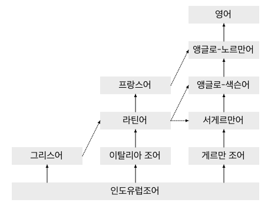

영어 학습과 라틴어와의 관계
===========================

고전 라틴어 학습과 현대 영어 학습은 전혀 무관한 관계이지만, 사회적으로 영어 학습에 대한 압박이 심하기 때문에 이 둘의 관계를 언급할 필요가 있다.

결론부터 말하면, 라틴어 학습으로 영어 학습에 도움을 받는다는 것은 기대하기 힘들다.

물론 영어는 직간접적으로 라틴어의 영향을 매우 많이 받은 언어이지만, 매우 동떨어져 있는 언어이기 때문이다. 심지어 라틴어와 매우 가깝다는 로망스 제어의 경우도 학습하기 위해 라틴어를 배워야 할 필요성은 거의 제로에 가깝다. 로망스어를 전공하는 경우도 일반적으로 다른 로망스어를 배우는 것을 라틴어를 배우는 것보다 우선하는 경우가 많다.

또한 20세기 중반까지만 하더라도 영미권 고등교육에서 라틴어가 차지하는 비중이 꽤 높았으나, 20세기 후반부터 영어가 사실상 국제어로 자리잡게 되면서 라틴어를 꼭 배워야 할 필요성이 현저히 줄어들게 되었다.

다만 현재도 북미와 유럽의 일부 학교 교육에서 전통적으로 라틴어를 중시하므로 유학을 준비하는 경우 목표하는 학교에 따라서 기초적인 라틴어 학습이 도움이 될 수도 있을 것이다. 그러나 이 역시 부차적인 요소일 것이다.

일반적으로 라틴어 학습이 영어 학습에 미치는 긍정적인 영향으로는 단어의 어원을 알게된다는 점을 드는 경우가 많은데, 물론 그 뜻을 알게 된다는 것은 좋지만 굳이 뜻을 알기 위해 라틴어의 변화까지 배울 필요는 없을 것이다. 영어의 접두어 정도로 이해해도 충분한 경우가 많다.

한자를 쓰지 못하더라도, 한자의 의미를 파악하는 것만으로도 한국어를 쓰고 익히는데 도움을 받는 것과 마찬가지라고 생각한다.

또, 영어는 우리말처럼 한자 단어 같은 것을 조합하여 쉽게 단어를 생성하는 언어가 아니다. 어떤 라틴어 어원을 안다고 해서 신조어를 만드는 경우가 아니고서는 그 단어로 새로운 단어를 조합해내기가 힘들다.

그리고 라틴어에서도 조금 어려운 단어는 그리스어에서 유래한 경우가 많다. 즉 어휘로만 보면 영어에서 그리스어 어원이 차지하는 비중이 더 높을 수도 있다. 그러나 이러한 이유로 그리스어를 배우라고 권하는 경우는 찾기 힘들다.

영어 학습을 위해 영어에 더욱 직접적인 영향을 미친 프랑스어나 비슷한 계통의 언어인 독일어를 배울 것을 권하는 사람도 없다. 영어에서 라틴어 학습 필요성을 제기하는 것은 중세 이후 서구 사회의 문화 풍습을 이해하지 못하고 이것을 언어 학습의 수단으로 착각하기 때문이다.

영어와 라틴어의 유사성은 의외의 심층적인 구조에서 찾을 수 있다. 첫째로는 라틴어에서 유래하지 않은 영어의 단어가 라틴어와 동일한 용례로 사용되는 경우가 많다.

   가령 work라는 명사가 라틴어 opus와 의미가 전반적으로 흡사하다. 이 경우 work라는 명사는 철자는 다르지만 라틴어 명사 opus에서 그 의미를 대다수 차용하여 사용한 경우에 해당한다. [한동일, 카르페 라틴어, 67쪽]

위 인용문에서 언급된 work는 게르만 조어에서 유래한 단어로, 라틴어와는 무관하다. 또, 영어 사전에 등재되어 있지만 잘 쓰이지 않는 의미가, 라틴어에서 사용하는 의미인 경우도 있다.

이러한 유사성은 문법에서도 나타난다. 예를 들어 영어에서 전치사 of를 쓰는 경우는 라틴어 속격 쓰는 구문인 경우가 있고, 영어의 of가 가지고 있는 여러 의미가 라틴어 속격과 겹치기도 한다. 라틴어에서 여격을 쓰는 구문은 영어에서 for로, 라틴어에서 탈격을 쓰는 구문은 영어에서 from을 쓰는 것으로 나타나기도 한다.

또한 종속절에 대한 접근 방법 같은 것도, 영어에는 라틴어와 같은 접속법 동사가 따로 없지만 마치 접속법 동사인 것처럼 다루어지는 경우가 많다.

한편 이러한 영어와 라틴어의 심층적인 유사성은 영어로 쓰여진 라틴어 번역을 이해하기 어렵게 할 수도 있다. 예를 들어 상기 예처럼 라틴어 opus를 설명하는 데는 영어 work 한 단어로 충분하지만, 한국어 화자는 work의 의미를 다시 찾아봐야 하기 때문이다.

영어 어휘에 미친 라틴어의 영향
------------------------------

라틴어는 영어 어휘에 여러 차례에 걸쳐 영향을 미친 것으로 알려져 있다.

기원전부터 게르만족이 로마 제국과 교류하면서 라틴어 어휘를 받아들이는데, 이때 수입된 어휘가 현대 영어에도 남아 있다. (mint(동전), wine 등)

서기 596년 교황 그레고리오 1세가 아우구스티누스를 브리튼 섬에 선교사로 파견한 것을 기점으로 많은 종교 관련 라틴어 어휘가 수입된다. (altar, minister, priest 등)

또한 이 시기 라틴어 알파벳으로 글을 쓰기 시작하였다.

1066년 노르만 정복 이후 오일어 계통의 노르만어를 사용하게 되었다. 모두 로망스어로 라틴어 어휘가 많았다.

앞서 말했듯이 이렇게 영어에 수입된 라틴어 어휘의 상당수가 그리스어 어원을 가지고 있기도 하다.

또한 영어로 편입된 어휘 이외에도, 중세 이후 라틴어가 종교, 학술, 법률, 외교 언어로 사용되었기 때문에 지식인들은 라틴어에 대한 이해도가 높았다.
